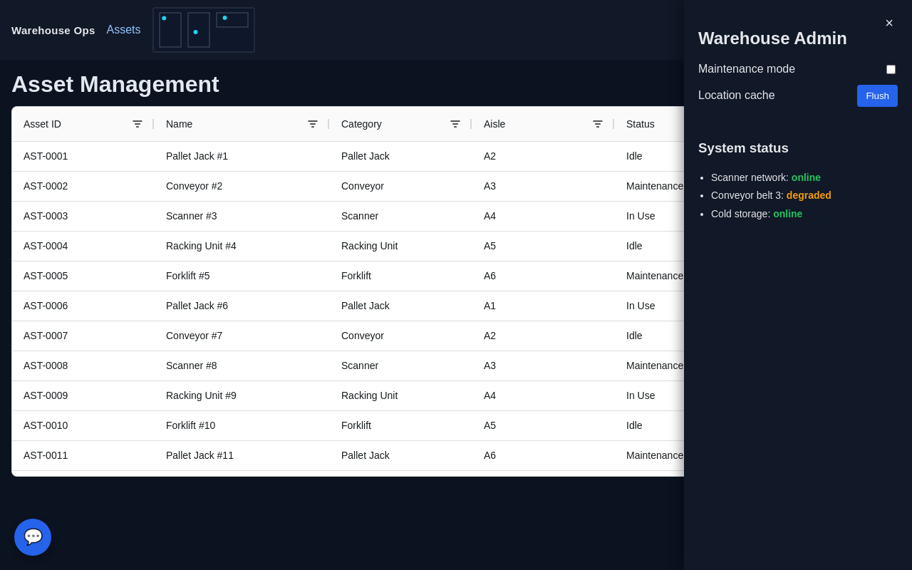
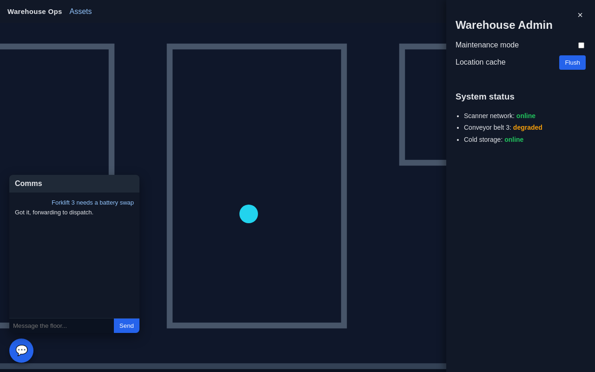

# single-spa root config, driven by YAML

[](https://github.com/janesenaj42/single-spa-root-config/actions/workflows/ci.yml)
[](https://conventionalcommits.org)
[](https://nodejs.org)
[](docker-compose.yml)

A `single-spa` root config where **registering a microfrontend is a YAML
edit, not a code change**. Each MFE gets one YAML file describing its
entry point, mount point, route, and who's allowed to see it. A small
script merges those files into a manifest the shell fetches at load time —
so adding, removing, or repointing an MFE never touches root-config's
JS/HTML, and 20 different teams can each own their own file.

Fully containerized, with a working `docker compose` demo — a warehouse
operations shell — that exercises **four different layout patterns** (top
navbar, full-page, floating drawer, floating widget) and **three
visibility tiers** (public / any logged-in user / role-gated) against a
real Keycloak instance.

- [Quick start](#quick-start)
- [Screenshots](#screenshots)
- [How it works](#how-it-works)
- [MFE config reference](#mfe-config-reference)
- [Layout patterns](#layout-patterns)
- [Authentication & role-based visibility](#authentication--role-based-visibility-keycloak)
- [Repo layout: core vs. examples](#repo-layout-core-vs-examples)
- [Adding a real MFE](#adding-a-real-mfe)
- [Development](#development)
- [Scaling past the MVP](#scaling-past-the-mvp)

## Quick start

```
docker compose up --build
```

Give Keycloak ~10-15s to finish starting and importing its demo realm,
then open **http://localhost:8090**. Check `docker compose logs keycloak`
for `Realm 'root-config-demo' imported` if the login redirect errors out.

The navbar and the comms bubble (bottom-right) are public, so they're
always there.

| Try it as | Password | You'll see |
|---|---|---|
| (stay logged out) | — | navbar + comms bubble |
| **bob** | `password` | + Assets page (`/assets`) |
| **alice** | `password` | + Assets, + an "Admin" button in the navbar that opens a drawer |

Five throwaway nginx containers (`navbar-mfe`, `assets-mfe`,
`admin-panel-mfe`, `comms-mfe`, plus `keycloak`) stand in for a real
deployment — see [Adding a real MFE](#adding-a-real-mfe) to replace them.

To see a config-only change take effect, edit e.g. `mfes/admin-panel.yaml`
then `docker compose restart root-config` — no rebuild needed, since
`mfes/` is a mounted volume, not baked into the image. Edit
`public/index.html` and just refresh the browser — no restart either
([ADR-0001](docs/adr/0001-mount-index-html-as-a-volume.md)).

## Screenshots

| Logged out | bob (authenticated) | alice (admin) |
|---|---|---|
|  |  |  |

| Admin drawer open | Comms widget open |
|---|---|
|  |  |

Captured with a scripted Playwright run against the actual `docker compose`
stack (not hand-curated), so they reflect real behavior, not intent.

**Better ways to showcase this, if you want more than static images:**
- **A short screen recording (GIF or MP4) of the Playwright run itself**
  is the natural upgrade — it'd show the *transitions* static screenshots
  can't (the drawer's slide-in, the worker dots jittering on the
  blueprint, the chat's canned-reply delay). Same script, just record the
  page instead of screenshotting it (Playwright supports video recording
  natively via `recordVideo` on the browser context), then convert to GIF
  with `ffmpeg`.
- **A tiny hosted demo** (the compose stack deployed somewhere public,
  or even just this repo + a "run in ~2 min" note) beats any recording
  for someone who wants to click around themselves — screenshots/GIFs
  go stale the moment a layout changes; a live instance can't.
- **Percy/Chromatic-style visual regression snapshots** if you want these
  screenshots to do double duty as a "did this layout change?" CI check,
  not just documentation — same Playwright script, pointed at a
  screenshot-diffing service instead of just saving PNGs.

## How it works

```
mfes/*.yaml  --(build-mfe-config.js)-->  dist/mfes.json  --(fetch)-->  root-config.js  --(registerApplication)-->  single-spa
```

- **`mfes/` is mounted, not baked into the image.** The container's
  `entrypoint.sh` regenerates `mfes.json` from the mounted directory at
  **startup**, not at image build time. Updating which MFEs are
  registered only needs a YAML edit + a container restart — not a
  root-config rebuild/redeploy.
- **root-config.js is generic.** It has no knowledge of any specific MFE;
  it just loops over whatever `mfes.json` contains and calls
  `registerApplication()`.
- **Validation is centralized.** `scripts/build-mfe-config.js` validates
  every YAML file against an `ajv` JSON schema and fails the
  build/startup on duplicate names or malformed config (unknown fields,
  wrong types, missing required fields) — you get a filename +
  field-level error instead of a silently broken shell.

## MFE config reference

```yaml
name: assets                 # unique app name
entry: "https://cdn.example.com/assets/assets.js"   # SystemJS bundle URL, loaded by the BROWSER
container: "#main"           # CSS selector the app mounts into (auto-created if missing - see Layout patterns)
activeWhen: "/assets"        # single-spa route prefix (string or array)
public: false                # optional, default false — see Authentication section
requiredRoles:                # optional — Keycloak realm roles, ANY of which grant access
  - admin
customProps:                 # optional, passed through to the MFE
  theme: dark
```

`entry` is fetched client-side via `System.import()`, so it must be an
address the user's **browser** can reach — not just something reachable
inside a Docker network (see `docker-compose.yml`, which publishes each
demo MFE on `localhost`).

## Layout patterns

The four warehouse MFEs deliberately exercise four different ways an MFE
can occupy the page, to prove the config-driven approach isn't just for
"one route = one full page":

| Pattern | MFE | `container` | `activeWhen` |
|---|---|---|---|
| Top bar, in normal document flow | `navbar` | `#navbar` (pre-defined in `index.html`) | `/` (always) |
| Full page | `assets` | `#main` (pre-defined in `index.html`) | `/assets` |
| Floating drawer, 25% width | `admin-panel` | `#wh-admin-drawer` (**not** in `index.html`) | `/` (always mounted; visibility toggled internally, not by route) |
| Floating widget (bottom-right) | `comms` | `#wh-comms-widget` (**not** in `index.html`) | `/` (always) |

The two floating ones prove [ADR-0002](docs/adr/0002-auto-vivify-mfe-containers.md):
root-config creates a missing container itself (appended to
`document.body`) rather than requiring every MFE's mount point to
pre-exist in `index.html`. Whether something reads as "full page" vs.
"floating drawer" vs. "floating bubble" is entirely the MFE's own CSS
(`position: fixed` + width/placement) — root-config doesn't know or care.

The admin drawer's open/close trigger lives in the **navbar** MFE, not in
the admin-panel MFE itself — a deliberate test of cross-MFE coordination,
since single-spa MFEs can't call each other directly. That's handled by
`src/eventBus.js` (`window` `CustomEvent`s, exposed to every MFE as
`publish`/`subscribe` via `customProps`), which is an interim
implementation with known gaps — see
[ADR-0003](docs/adr/0003-interim-cross-mfe-event-bus.md) for what's
missing and why it hasn't been replaced with a real pub/sub library yet.
The comms widget, by contrast, is fully self-contained (owns both its
own trigger icon and its own panel) and needs no cross-MFE messaging at
all.

See [CONTEXT.md](CONTEXT.md) for the vocabulary this section uses
(layout region, auto-vivified container, drawer, cross-MFE event).

## Authentication & role-based visibility (Keycloak)

Which MFEs are even eligible to mount depends on who's logged in, not
just the URL. Each MFE is one of three tiers, set in its YAML file:

| Tier | YAML | Example |
|---|---|---|
| Public | `public: true` | `navbar`, `comms` — always mount, regardless of login state |
| All authenticated users | neither `public` nor `requiredRoles` set | `assets` — mounts for anyone logged in, regardless of role |
| Selected users by role | `requiredRoles: [admin, finance]` | `admin-panel` — only mounts if the user holds at least one of these Keycloak **realm roles** |

`root-config.js` wraps each app's `activeWhen` in a function that checks,
in order: the route still has to match, then `public` short-circuits to
true, otherwise the user must be authenticated and hold a matching role.
Route matching and auth/role checks are independent — a route match with a
failed role check just means that container stays empty on that URL, it
doesn't error. (This decision logic lives in `src/routing.js#isAppActive`,
unit tested in `test/routing.test.js`.)

Auth itself is handled once, centrally, by `src/auth.js` using `keycloak-js`
— individual MFEs never talk to Keycloak directly. Every MFE receives
`isAuthenticated()`, `hasAnyRole()`, `getToken()`, `login()`, `logout()`
via `customProps`, so an MFE that needs to call a protected API — or just
conditionally render something, like the navbar's Admin button — can do
so without knowing anything about your Keycloak setup.

The Keycloak client config (`url`, `realm`, `clientId`) is generated at
container startup from `KEYCLOAK_URL` / `KEYCLOAK_REALM` /
`KEYCLOAK_CLIENT_ID` env vars into `keycloak.json` — same "no rebuild
needed" pattern as `mfes.json`. `KEYCLOAK_URL` must be reachable from the
**browser** (keycloak-js runs client-side).

### The demo's Keycloak

`docker-compose.yml` runs a real Keycloak (`quay.io/keycloak/keycloak`) on
**8180** (not 8080, so it doesn't collide with an unrelated Keycloak you
might already have running on this machine), and imports
`examples/keycloak/realm-export.json` on startup — no manual admin-console
setup needed. That realm (`root-config-demo`) pre-seeds:

- A public client `root-config` with redirect URI / web origin
  `http://localhost:8090/*` (PKCE, no client secret — this is a browser SPA).
- Two realm roles: `user`, `admin`.
- Two demo users, password `password` for both: **alice** (`user`+`admin`)
  and **bob** (`user` only).

`directAccessGrantsEnabled` is turned on for that client purely so the
setup can be sanity-checked with `curl` (password grant) without a
browser; the app itself uses the standard authorization-code + PKCE flow.
The admin console is at http://localhost:8180 (`admin` / `admin`, from
`KC_BOOTSTRAP_ADMIN_USERNAME` / `KC_BOOTSTRAP_ADMIN_PASSWORD`) if you want
to inspect or extend the realm.

**This realm is for the demo only.** For a real deployment, point
`KEYCLOAK_URL` / `KEYCLOAK_REALM` / `KEYCLOAK_CLIENT_ID` at your actual
Keycloak instead of running one from this compose file.

## Repo layout: core vs. examples

```
CORE (the actual root-config engine — this is what you'd extract into your own project)
├── src/root-config.js          Bootstraps single-spa: fetches mfes.json, registers every app.
├── src/routing.js              Pure route + public/auth/role gating logic (unit tested).
├── src/auth.js                 Centralized Keycloak client (keycloak-js).
├── src/containers.js           Auto-vivifies a missing container div (ADR-0002, unit tested).
├── src/eventBus.js             Interim cross-MFE pub/sub over window CustomEvents (ADR-0003, unit tested).
├── scripts/build-mfe-config.js Merges + ajv-validates mfes/*.yaml into dist/mfes.json.
├── scripts/build-keycloak-config.js  Writes dist/keycloak.json from KEYCLOAK_* env vars.
├── test/                       node --test unit tests for the modules above.
├── docker/                     nginx.conf + entrypoint.sh baked into the runtime image.
├── Dockerfile                  3-stage build: deps -> esbuild bundle -> nginx + node runtime.
├── mfes/*.yaml                 Where YOU register your MFEs (this repo's copy registers the example ones below).
└── public/                     The layout shell (index.html) + Keycloak's silent-check-sso.html.

EXAMPLES (throwaway scaffolding for the demo — not part of the product)
├── examples/demo-mfes/         Four warehouse-themed MFEs exercising all 4 layout patterns.
├── examples/keycloak/          Realm export auto-imported by the demo's Keycloak container.
└── docker-compose.yml          Wires core + examples into one runnable stack (repo root, not under examples/,
                                 since it's the thing you run - but everything it points at under examples/ is disposable).

DOCS
├── CONTEXT.md                  Glossary for the terms this README uses.
├── docs/adr/                   Architecture decision records (why, not what).
├── docs/wiki/                  RepoWise's exported markdown wiki (structural, regenerate via `repowise export`).
├── docs/screenshots/           Screenshots referenced above, captured via a scripted Playwright run.
├── .mcp.json, .vscode/mcp.json RepoWise's MCP server, wired into Claude Code / VS Code.
├── .claude/CLAUDE.md           Agent-facing codebase summary, generated by RepoWise.
└── requirements.txt            Pins RepoWise's version for `pip install -r requirements.txt`.
```

If you're adopting this for a real project: keep everything under `CORE`,
delete everything under `EXAMPLES`, and replace `mfes/*.yaml` +
`public/index.html`'s layout regions with your own.

## Adding a real MFE

1. Deploy the MFE's SystemJS bundle somewhere reachable by browsers.
2. Add `mfes/<name>.yaml` with `name`, `entry`, `container`, `activeWhen`,
   and `public`/`requiredRoles` if it needs to be gated by login or role.
3. If `container` doesn't already exist in `index.html`, root-config
   creates it for you (appended to `<body>`) — fine for anything
   positioned via CSS (floating widgets, drawers). If it needs a specific
   place in normal document flow instead, add a matching `<div id="...">`
   to `public/index.html` — no rebuild needed, just a restart-free file
   edit ([ADR-0001](docs/adr/0001-mount-index-html-as-a-volume.md)).
4. Restart the root-config container to pick up the new YAML (or
   redeploy, if `mfes/` lives outside the container image in your setup —
   e.g. synced from a git repo or config service).

## Development

```
npm install     # also wires up git hooks via husky's "prepare" script
npm run build   # bundles root-config.js and merges mfes/*.yaml into dist/
npm run serve   # serves dist/ on :8080
npm test        # node's built-in test runner
npm run lint    # eslint
```

Built and tested against Node 20 LTS; any current Node LTS should work
fine given the project only uses long-stable APIs (native `EventTarget`/
`CustomEvent`, `node:test`).

### Commit messages & releases

Commits follow [Conventional Commits](https://www.conventionalcommits.org/)
(`feat: ...`, `fix: ...`, `docs: ...`, `chore: ...`, etc.), enforced on
`git commit` by husky + commitlint (`commitlint.config.js`). A pre-commit
hook also runs `npm run lint && npm test`.

> Both hooks skip themselves with a warning if `npm`/`npx` aren't on
> `PATH`, so they degrade gracefully on a machine without Node installed
> locally (e.g. if you only ever run this project through Docker) —
> they just won't enforce anything in that case.

Versioning and `CHANGELOG.md` generation are driven by those commit types
via [`commit-and-tag-version`](https://github.com/absolute-version/commit-and-tag-version)
(the maintained drop-in replacement for the now-unmaintained
`standard-version` — same CLI and config):

```
npm run release   # bumps version per commit history, updates CHANGELOG.md, tags
```

### CI

`.github/workflows/ci.yml` runs on every push/PR: unit tests, `ajv`
validation of the real `mfes/*.yaml` files, and a check that the Docker
image still builds.

### Documentation tooling

Two external tools help keep repo documentation current without hand
maintenance — used instead of a GitHub Wiki, which this repo can't enable
via the web UI without a maintainer with admin access clicking
Settings → General → Features → Wikis:

**[RepoWise](https://github.com/repowise-dev/repowise)** (Python) indexes
the repo into a dependency graph, git history, and auto-generated wiki
pages, then exposes them to Claude Code and other MCP-compatible agents.
Its deterministic analysis needs no API key — already run against this
repo, output in [`docs/wiki/`](docs/wiki/):

```
python -m venv .venv
. .venv/bin/activate        # .venv\Scripts\activate on Windows
pip install -r requirements.txt
repowise init --no-prose -y            # keyless: graph, git history, dead-code, docs
repowise export --format markdown -o docs/wiki   # human-readable snapshot, committed to the repo
```

`repowise init` builds a local index — caches, a vector DB, a SQLite
wiki DB (`.repowise/`, gitignored, regenerate anytime) — and wires up
`.mcp.json` / `.vscode/mcp.json` so Claude Code and VS Code pick up its
MCP server automatically, plus a `.husky/post-commit` hook that
re-syncs the index after every commit. `docs/wiki/` is a point-in-time
`export`, not the live index — re-run `export` after `update` to refresh
it. The generated pages here are **structural only** ("template"
content, per each page's footer) since no LLM key was supplied; optional
LLM-backed features (richer prose, PR/git-history analysis) need your own
`ANTHROPIC_API_KEY`/`OPENAI_API_KEY`/`GEMINI_API_KEY` — see their docs.

**[OpenWiki](https://github.com/langchain-ai/openwiki)** (Node, from
LangChain) writes and maintains narrative documentation for coding
agents into an `openwiki/` directory, refreshed on a schedule via
`.github/workflows/openwiki-update.yml`. Unlike RepoWise, it has **no
keyless mode** — it always calls an LLM to write the docs. To use it:

1. Add an inference provider key as a repo secret (the workflow defaults
   to `ANTHROPIC_API_KEY`; swap `OPENWIKI_PROVIDER` + the secret name for
   OpenAI/Gemini/OpenRouter/etc.).
2. Add a fine-grained PAT with `Contents: read/write` and
   `Pull requests: read/write` as `OPENWIKI_PR_TOKEN` (needed so the
   scheduled run can open/auto-merge its own PR).
3. Enable "Allow auto-merge" in repo settings, or drop that step and
   review the PRs manually.
4. Run `openwiki --init` locally once to seed `openwiki/` — the
   scheduled workflow only *updates* an existing wiki, it doesn't create
   the initial one.

OpenWiki hasn't been run against this repo — it needs credentials (an
LLM API key, plus a PAT for the scheduled-PR workflow) that aren't
available in this environment. The scaffolding above is ready to go once
you supply them.

## Scaling past the MVP

This is intentionally minimal. Natural next steps as you grow past a
handful of MFEs:

- ~~Schema validation~~ — done: `build-mfe-config.js` validates every YAML
  file against an `ajv` JSON schema.
- **A real cross-MFE event bus** — see
  [ADR-0003](docs/adr/0003-interim-cross-mfe-event-bus.md); the current
  `window` `CustomEvent`s wrapper has no topic discovery and no async
  composition. Pending a decision between `emittery` and RxJS.
- **Per-environment overlays** — `mfes/prod/*.yaml`, `mfes/staging/*.yaml`,
  selected via `MFE_CONFIG_DIR`, instead of one shared set.
- **Hot reload without a restart** — a file watcher (`chokidar`) that
  regenerates `mfes.json` on change, paired with an SSE/WebSocket ping to
  the browser to prompt `registerApplication`/`unregisterApplication` diffs
  instead of a full page reload.
- **Config as a service** — for 20+ teams, move `mfes/` out of a mounted
  directory into a tiny CRUD API (backed by git or a database) with an
  admin UI, so teams don't need filesystem/container access to change
  their own entry.
- **Declarative layout** — if MFEs need to nest, redirect, or share layout
  regions in more complex ways than "prefix route into a named div", look
  at [`single-spa-layout`](https://single-spa.js.org/docs/layout-overview)
  and mirror its JSON schema in YAML instead of this flat one.
