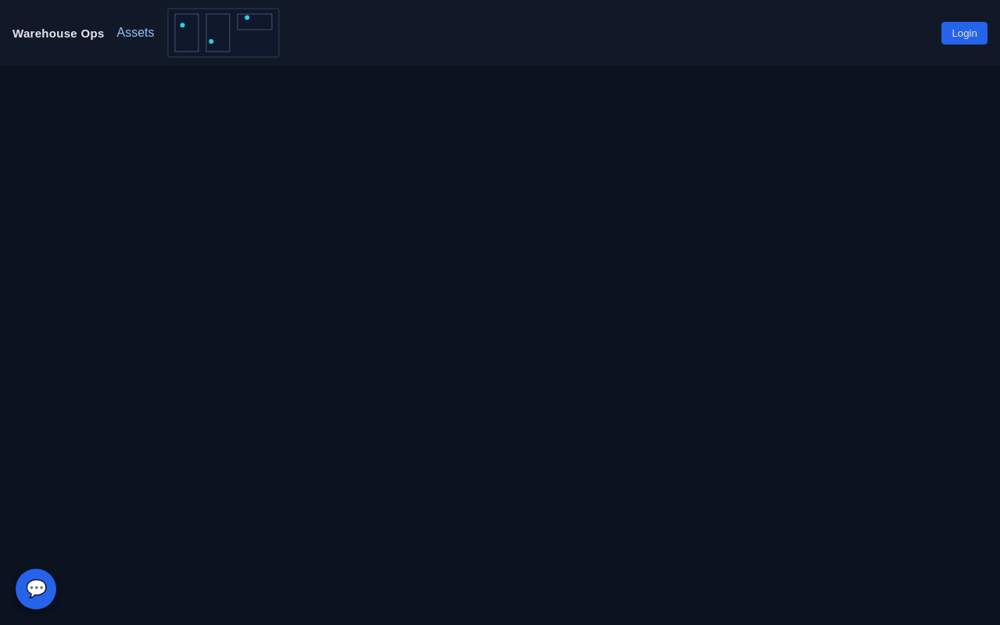
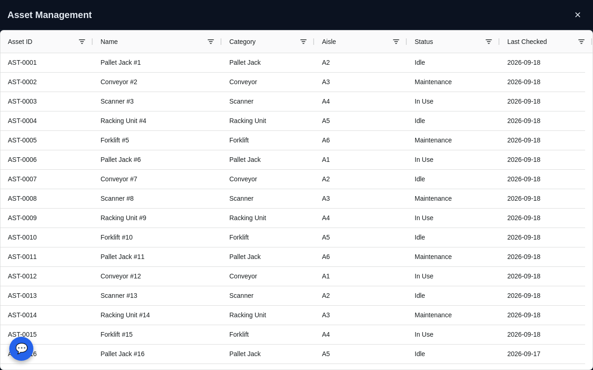
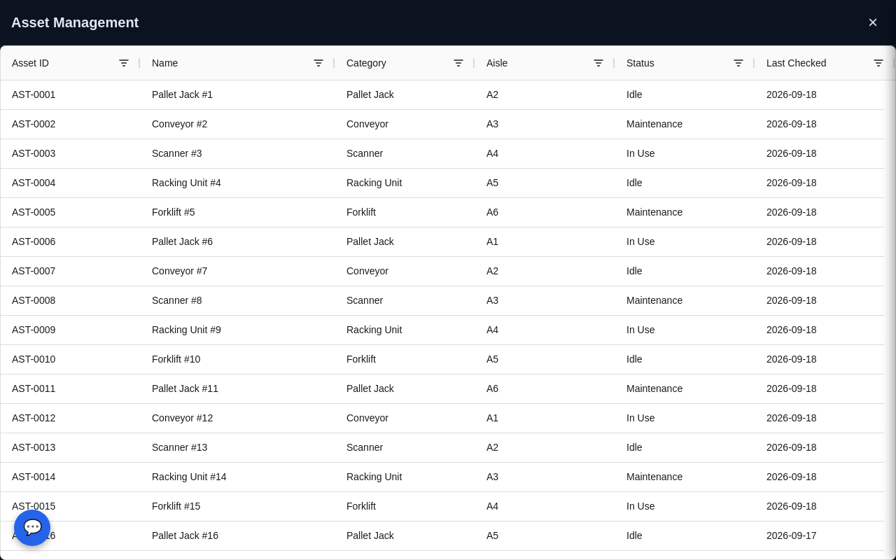

# single-spa root config, driven by YAML

[](https://github.com/janesenaj42/single-spa-root-config/actions/workflows/ci.yml)

Register a microfrontend by adding a YAML file — no code change in
root-config. Each MFE's YAML declares its entry point, mount point,
route, and who's allowed to see it (public / any logged-in user /
role-gated via Keycloak).

Fully containerized. The included demo is a warehouse-ops shell
exercising 4 layout patterns (top navbar, full page, floating drawer,
floating widget) against a real Keycloak instance.

## Quick start

```
docker compose up --build
```

Give Keycloak ~10-15s to finish importing its demo realm, then open
**http://localhost:8090**.

| Try it as | Password | You'll see |
|---|---|---|
| (stay logged out) | — | navbar + comms bubble |
| **bob** | `password` | + Assets page (`/assets`) |
| **alice** | `password` | + Assets, + an "Admin" button that opens a drawer |

| Logged out | bob (authenticated) | alice (admin) |
|---|---|---|
|  |  |  |

To see a config-only change take effect, edit a file under `mfes/` then
`docker compose restart root-config` — no rebuild needed, `mfes/` is a
mounted volume, not baked into the image.

## How it works

```
mfes/*.yaml  --(build-mfe-config.js)-->  dist/mfes.json  --(fetch)-->  root-config.js  --(registerApplication)-->  single-spa
```

`root-config.js` is generic — it has no knowledge of any specific MFE,
it just loops over `mfes.json` and calls `registerApplication()`. Adding,
removing, or repointing an MFE is a YAML edit; a bad one fails loudly at
startup (`ajv` schema validation) instead of silently breaking the shell.

## Development

```
npm install     # also wires up git hooks via husky's "prepare" script
npm run build   # bundles root-config.js and merges mfes/*.yaml into dist/
npm run serve   # serves dist/ on :8080
npm test        # node's built-in test runner
npm run lint    # eslint
```

Commits follow [Conventional Commits](https://www.conventionalcommits.org/),
enforced by husky + commitlint. `npm run release` bumps the version and
updates `CHANGELOG.md` via `commit-and-tag-version`. See
`.github/workflows/ci.yml` for what CI checks on every push/PR.

## Learn more

- **[docs/CONFIGURATION.md](docs/CONFIGURATION.md)** — full MFE config
  reference, the four layout patterns explained, Keycloak/auth setup,
  the repo's core-vs-examples layout, adding a real MFE, and the
  RepoWise/OpenWiki documentation tooling.
- **[docs/adr/](docs/adr/)** — architecture decision records (the *why*
  behind non-obvious choices).
- **[docs/wiki/](docs/wiki/)** — RepoWise's auto-generated wiki.
- **[CONTEXT.md](CONTEXT.md)** — glossary for terms used throughout.
- **Roadmap** — tracked as GitHub issues, not inlined here; see the
  [issues tab](https://github.com/janesenaj42/single-spa-root-config/issues).
