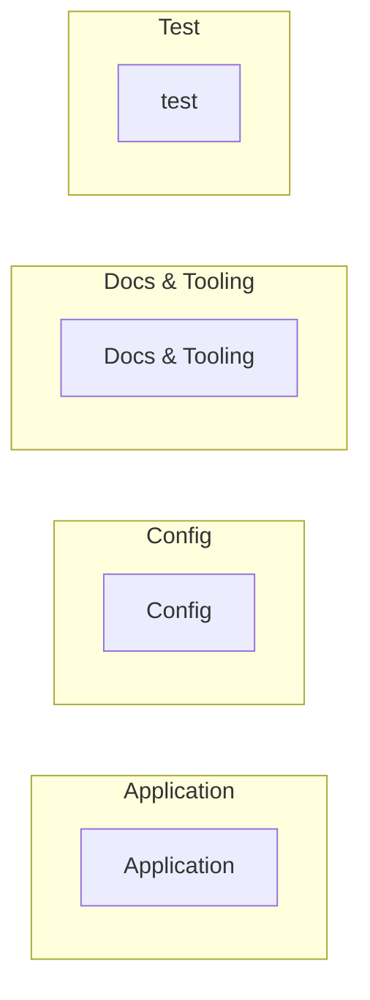

# Repository Overview: app

# Repository Overview: app

**Files:** 39 | **Lines:** 1699

## Project Summary

`app` is a javascript codebase of 39 files.

## Primary Execution Flows

- `src/root-config.js::bootstrap` (4 steps)

---

*Built from the code's structure. It states what is there, not why it is that
way. The explanatory prose is a separate, model-written layer.*

## Architecture map

